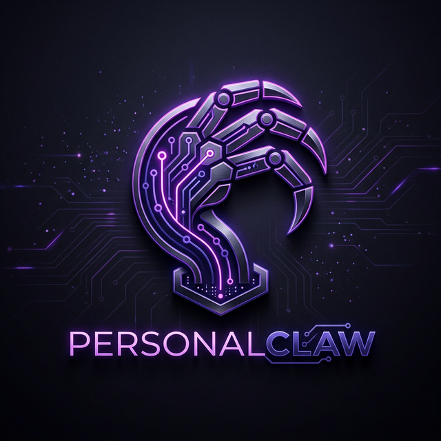

# PersonalClaw: End-User Guide 🛸



Welcome to **PersonalClaw**, your high-performance AI agent for Windows automation and remote control. This guide will help you master your new digital companion.

---

## 🌟 Introduction
PersonalClaw is a private, local AI agent powered by **Gemini 3 Flash**. It gives you eyes and hands on your Windows machine, accessible via a web dashboard or a secure Telegram bot.

---

## ⚡ How to Start
To launch the PersonalClaw system, you need to run two separate commands in different terminal windows:

1. **The Brain**: In the project root, run:
   ```bash
   npm run dev
   ```
2. **The Dashboard**: Navigate to the `dashboard` folder and run:
   ```bash
   npm run dev
   ```

Wait a few seconds for both to initialize, then head to [http://localhost:5173](http://localhost:5173)!

---

## 🚀 Ways to Connect

### 1. The Command Center (Web Dashboard)
- **URL**: [http://localhost:5173](http://localhost:5173)
- **Features**: Real-time system telemetry (CPU/RAM), glassmorphic dark/light mode, and full markdown chat experience.
- **📸 Dashboard Screenshot**: Click the **Camera icon** next to the chat box to capture any window or your entire screen. PersonalClaw will process it immediately!
- **Tip**: Use `Shift + Enter` for line breaks and `Enter` to send.

### 2. Telegram Bot (Mobile Control)
- **Bot**: [@Personal_Clw_bot](https://t.me/Personal_Clw_bot)
- **Security**: Locked to your specific Chat ID (Defined in your `.env`). No one else can command it.
- **Usage**: Send text or photos from anywhere in the world to trigger your machine.

### 3. Browser Relay (Active Control)
- **Extension**: Load from the `/extension` folder in Chrome.
- **Power**: Allows the agent to "see" your active browser tabs, scrape data, and click buttons on real sites.

---

## 🧠 Core Capabilities

### 📸 Proactive Vision
PersonalClaw can see what you see.
- **Ask**: *"What's on my screen right now?"* or *"Analyze the Nilear page for ticket 962869."*
- **Archive**: All captures are saved to `\screenshots` for your records.

### 🐚 Windows Shell (PowerShell)
Complete system control without touching the keyboard.
- **Ask**: *"List my largest files in Downloads"* or *"Check if the backup service is running."*

### 📁 File Management
Organize, read, and create files effortlessly.
- **Ask**: *"Create a summary of my project notes"* or *"Move all .pdf files from Desktop to a new folder called Docs."*

---

## 🛠️ Key Commands

> [!IMPORTANT]
> **`/new`**: Type this to start a completely fresh session. It clears the AI's short-term memory and starts a new log file in the `\memory` folder. Use this when switching tasks to save performance and tokens.

---

## 🗄️ Where is my data?
- **Logs**: `\memory\session_TIMESTAMP.json` (Full chat records).
- **Screenshots**: `\screenshots\` (Historical visual captures).
- **Documentation**: `\docs\` (This guide and technical specs).

---

## 🆘 Troubleshooting
- **Extension Disconnected?** Go to `chrome://extensions` and click the **Refresh** icon.
- **Bot not responding?** Ensure `npm run dev` is running in the main project folder.

---

*“PersonalClaw: Your machine, your command, anywhere.”*

**Developed by Sagar Kalra**
