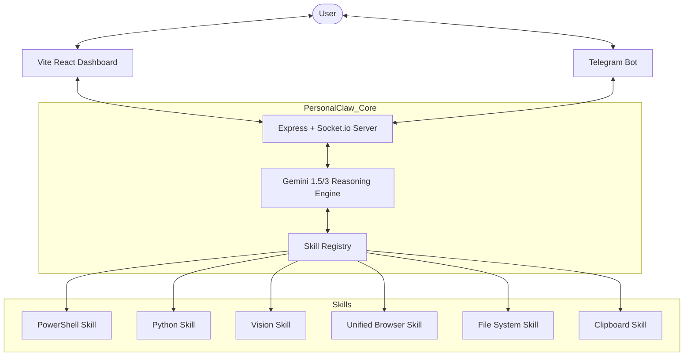

# PersonalClaw Technical Documentation 🦾

PersonalClaw is a modular AI agent designed for autonomous Windows control and automation. It uses Google's **Gemini** model family as its reasoning engine and features a real-time reactive dashboard with multi-chat workspaces, sub-agent workers, and a skill lock system.

**Current Version:** v11.0.0 (March 2026)

---

## 🏗️ Core Architecture (v11)

PersonalClaw uses a multi-brain architecture. The **ConversationManager** manages up to 3 independent **Brain** instances (one per chat pane). Each Brain can spawn up to 5 **Worker Agents** via the **AgentRegistry**. The **SkillLockManager** prevents resource conflicts across concurrent agents.

### Key v11 Systems
| System | File | Purpose |
|---|---|---|
| Brain (class) | `src/core/brain.ts` | Gemini integration, tool loop, abort, meta passing |
| ConversationManager | `src/core/conversation-manager.ts` | Up to 3 chat panes with isolated Brains |
| AgentRegistry | `src/core/agent-registry.ts` | Worker lifecycle, queue, timeout, kill |
| SkillLockManager | `src/core/skill-lock.ts` | Exclusive + read-write locks for shared resources |
| EventBus | `src/core/events.ts` | 25+ typed events, decoupled communication |
| TelegramBrain | `src/core/telegram-brain.ts` | Isolated Brain for Telegram (outside ConversationManager) |



---

## 📂 Project Structure

### Backend (`/src`)
- `index.ts`: The main entry point. Sets up the Express server, Socket.io hub, and real-time system metrics (CPU/RAM) broadcasting.
- `core/brain.ts`: Orchestrates the conversation with Gemini. Implements the tool-use loop (Function Calling) allowing the agent to chain multiple actions.
- `skills/`: Standardized modules for system interaction.
- `interfaces/`: Communication providers (e.g., Telegram).
- `types/`: Shared TypeScript definitions.

### Frontend (`/dashboard`)
- `src/App.tsx`: A high-end React UI using `framer-motion` for animations and `lucide-react` for iconography.
- `src/index.css`: Custom "Glassmorphism" design system.

---

## 🛠️ The Skill System

Every skill follows a standardized `Skill` interface to ensure compatibility with Gemini's tool definition format.

### Standard Skill Definition:
```typescript
export interface Skill {
  name: string;
  description: string;
  parameters: object; // JSON Schema
  run: (args: any) => Promise<any>;
}
```

### Integrated Skills (15):
1. **PowerShell (`execute_powershell`)**: Full OS control. Returns stdout, stderr, and success status.
2. **Python (`run_python_script`)**: Executes arbitrary Python code. High-flexibility data processing.
3. **Files (`manage_files`)**: Handles file CRUD: `read`, `write`, `append`, `delete`, and `list`. Per-path write lock.
4. **Browser (`browser`)**: Unified triple-mode browser (Playwright, Native Chrome, Extension Relay). Exclusive `browser_vision` lock.
5. **Vision (`analyze_vision`)**: Captures screenshots and passes to Gemini Vision. Shares `browser_vision` exclusive lock with browser.
6. **Clipboard (`manage_clipboard`)**: Reads and writes to the Windows system clipboard. Exclusive `clipboard` lock.
7. **Long-Term Memory (`manage_long_term_memory`)**: Persists user preferences. Read-write `memory` lock.
8. **Scheduler (`manage_scheduler`)**: Cron job management. Read-write `scheduler` lock.
9. **HTTP (`http_request`)**: REST API calls (GET/POST/PUT/DELETE).
10. **Network (`network_diagnostics`)**: Ping, traceroute, DNS, port checks, interfaces.
11. **Process Manager (`manage_processes`)**: Process/service management, resource monitoring.
12. **System Info (`system_info`)**: Deep hardware/software diagnostics.
13. **PDF (`manage_pdf`)**: 8 PDF operations (extract, merge, split, rotate, watermark, create). Per-path write lock on output files.
14. **Image Generation (`generate_image`)**: AI image generation via Gemini Imagen.
15. **Agent Spawn (`spawn_agent`)**: Spawn sub-agent workers for parallel task execution (v11).


---

## 📡 Messaging Protocols

### Socket.io Events (v11)
| Event | Direction | Payload |
|---|---|---|
| `message` | Client → Server | `{ text, conversationId, image? }` |
| `response` | Server → Client | `{ conversationId, text, isError? }` |
| `conversation:create` | Client → Server | (none) |
| `conversation:created` | Server → Client | ConversationInfo |
| `conversation:close` | Client → Server | `{ conversationId }` |
| `conversation:closed` | Server → Client | `{ conversationId }` |
| `conversation:list` | Bidirectional | ConversationInfo[] |
| `agent:list` | Client → Server | `{ conversationId }` |
| `agent:update` | Server → Client | `{ conversationId, workers[] }` |
| `agent:logs` | Bidirectional | `{ agentId, logs[] }` |
| `tool_update` | Server → Client | `{ conversationId, type, tool, timestamp }` |
| `metrics` | Server → Client | `{ cpu, ram, totalRam, disk, totalDisk }` |
| `activity` | Server → Client | ActivityItem |
| `init` | Server → Client | `{ version, skills, metrics, activity, conversations }` |

### REST API Endpoints (v11)
| Method | Path | Purpose |
|---|---|---|
| `POST` | `/api/chat` | Send message (routes to Chat 1, creates if needed) |
| `POST` | `/api/conversations` | Create new conversation |
| `GET` | `/api/conversations` | List active conversations |
| `DELETE` | `/api/conversations/:id` | Close and save conversation |
| `GET` | `/api/conversations/:id/agents` | List workers for conversation |
| `GET` | `/api/agents/:agentId/logs` | Get worker raw logs |
| `GET` | `/api/locks` | Get current skill lock state |
| `GET` | `/api/skills` | List all skills |
| `GET` | `/api/sessions` | List saved sessions |
| `GET` | `/api/sessions/search?q=` | Search sessions |
| `GET` | `/api/sessions/stats` | Session statistics |
| `GET` | `/api/metrics` | Current system metrics |
| `GET` | `/api/audit` | Audit log entries |
| `GET` | `/api/relay` | Extension relay status |
| `GET` | `/api/activity` | Recent activity feed |
| `GET` | `/status` | Health check |

---

## ⚙️ AI Logic (Brain Loop)

PersonalClaw runs a **multi-turn tool execution loop** per Brain instance:
1. User sends message to a conversation pane.
2. ConversationManager routes to that pane's Brain.
3. Brain analyzes intent, calls tools via `handleToolCall(name, args, meta)`.
4. `SkillMeta` (agentId, conversationId, label, isWorker) passed to every skill.
5. Skills acquire locks if needed (exclusive or read-write), execute, release in `finally`.
6. Exclusive-lock skills run sequentially within a batch; others run in parallel.
7. Worker agents spawned via `spawn_agent` get their own Brain instance with guardrails.
8. Loop repeats until Brain has all data for a final response (max 25 tool rounds).

---

## 🛠️ Developer Setup

### Prerequisites
- Node.js v20+
- Python 3.x
- Gemini API Key

### Installation
```bash
git clone <repo>
npm install
npx playwright install chromium
```

### Environment Variables (.env)
```env
GEMINI_API_KEY=your_key
PORT=3000
TELEGRAM_BOT_TOKEN=optional_token
```

---

## 🤖 AI Integration Note
This codebase is designed to be **Self-Documenting for Models**. The `Brain` utilizes structured tool definitions fetched directly from the skill modules, meaning any LLM reading this repo should be able to instantly understand the available capabilities by inspecting the `src/skills/` directory.
